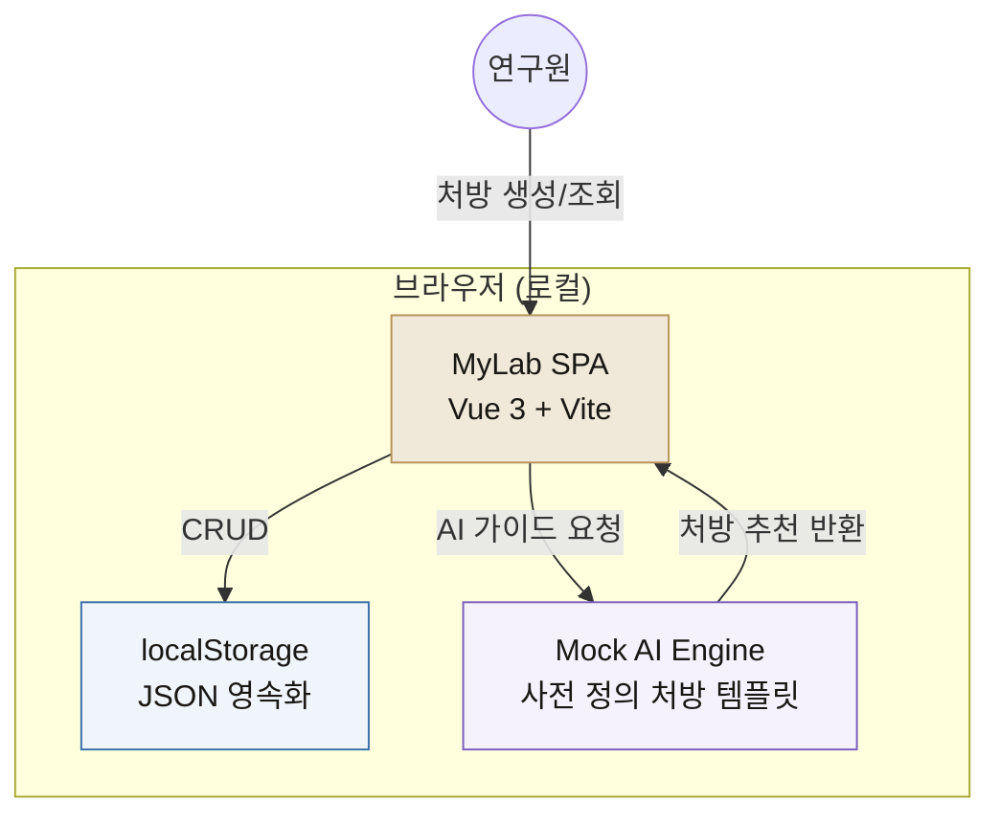
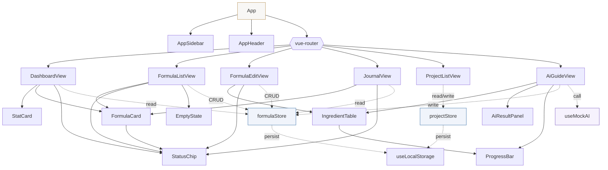
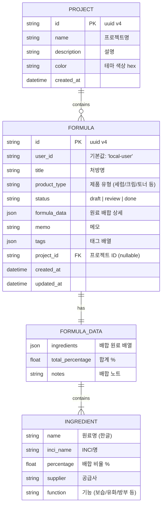
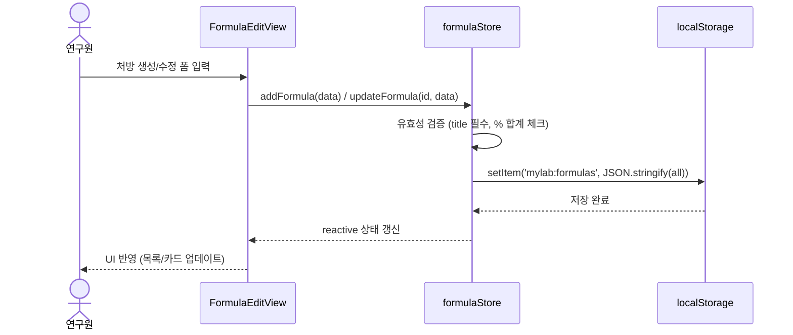
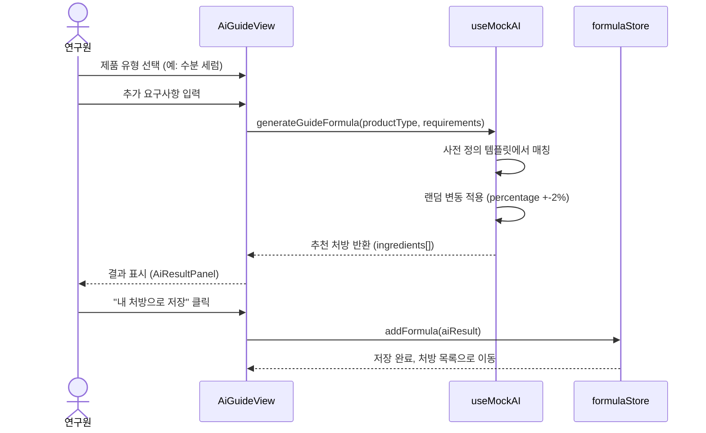

# MyLab 로컬 테스트 프로토타입 - 기술 아키텍처

> 화장품 가이드 처방 생성 웹앱 프로토타입
> 작성일: 2026-03-11

---

## 1. 설계 대안 분석

### 대안 A: Single HTML (CDN 기반, Zero-install)

| 항목 | 내용 |
|------|------|
| 구성 | `index.html` 1개 파일 (Vue 3 CDN + 인라인 CSS) |
| 장점 | npm 불필요, 더블클릭으로 실행, 공유 용이 |
| 단점 | SFC 불가, 컴포넌트 분리 어려움, IDE 지원 약함 |
| 적합 | 빠른 데모, 비개발자 공유 |

### 대안 B: Vue 3 + Vite 미니멀 프로젝트 (권장)

| 항목 | 내용 |
|------|------|
| 구성 | Vite 프로젝트, SFC 컴포넌트, localStorage 영속화 |
| 장점 | SFC/HMR 지원, 컴포넌트 재사용, Vue 2 통합시 참고 가능 |
| 단점 | `npm install` 필요 (약 30초) |
| 적합 | 실제 개발 프로토타입, 향후 통합 기반 |

### 결정: 대안 B (Vue 3 + Vite)

이유:
1. 기존 `MyLab.vue`, `ResearchOverview.vue`의 컴포넌트 구조를 프로토타입에서 먼저 검증 가능
2. 프로토타입 완료 후 Vue 2 Options API로 포팅하면 `Coching-User-Vue`에 통합 가능
3. localStorage 사용으로 서버 의존성 제거, 순수 프론트엔드 테스트

---

## 2. 시스템 컨텍스트



---

## 3. 디렉토리 구조

```
E:\COCHING\MyLab-Prototype\
├── index.html
├── package.json
├── vite.config.js
├── public/
│   └── favicon.ico
└── src/
    ├── main.js                    # Vue 앱 진입점
    ├── App.vue                    # 루트 레이아웃 (사이드바 + 콘텐츠)
    ├── tokens.js                  # 디자인 토큰 (White Lab 테마)
    │
    ├── stores/                    # 상태 관리 (reactive + localStorage)
    │   ├── formulaStore.js        # 처방 CRUD + 영속화
    │   └── projectStore.js        # 프로젝트 그룹핑
    │
    ├── composables/               # 공유 로직
    │   ├── useLocalStorage.js     # localStorage 래퍼
    │   └── useMockAI.js           # AI 가이드 처방 시뮬레이터
    │
    ├── views/                     # 페이지 단위 뷰
    │   ├── DashboardView.vue      # 대시보드 (KPI + 최근 처방)
    │   ├── FormulaListView.vue    # 처방 목록 + CRUD
    │   ├── FormulaEditView.vue    # 처방 상세/편집
    │   ├── JournalView.vue        # 처방 일지 (타임라인)
    │   ├── ProjectListView.vue    # 프로젝트 관리
    │   └── AiGuideView.vue        # AI 가이드 처방
    │
    └── components/                # 재사용 UI 컴포넌트
        ├── layout/
        │   ├── AppSidebar.vue     # 사이드바 네비게이션
        │   └── AppHeader.vue      # 상단 헤더 (날짜, 액션)
        ├── common/
        │   ├── StatCard.vue       # KPI 카드
        │   ├── StatusChip.vue     # 상태 뱃지 (draft/review/done)
        │   ├── ProgressBar.vue    # 진행률 바
        │   └── EmptyState.vue     # 빈 상태 안내
        └── formula/
            ├── FormulaCard.vue    # 처방 목록 카드
            ├── IngredientTable.vue # 원료 배합표
            └── AiResultPanel.vue  # AI 결과 표시 패널
```

---

## 4. 컴포넌트 의존성 그래프



---

## 5. 데이터 모델 ERD



### localStorage 키 구조

```
mylab:formulas   → Formula[]     (전체 처방 배열)
mylab:projects   → Project[]     (전체 프로젝트 배열)
mylab:settings   → { theme, lastView }  (사용자 설정)
```

---

## 6. 라우트 구조

| 경로 | 뷰 | 설명 |
|------|-----|------|
| `/` | `DashboardView` | 대시보드 (기본) |
| `/formulas` | `FormulaListView` | 처방 목록 |
| `/formulas/new` | `FormulaEditView` | 새 처방 생성 |
| `/formulas/:id` | `FormulaEditView` | 처방 상세/편집 |
| `/journal` | `JournalView` | 처방 일지 |
| `/projects` | `ProjectListView` | 프로젝트 관리 |
| `/ai-guide` | `AiGuideView` | AI 가이드 처방 |

---

## 7. 데이터 플로우

### 7-1. 처방 CRUD 플로우



### 7-2. AI 가이드 처방 플로우



---

## 8. 핵심 모듈 설계

### 8-1. formulaStore.js (Composition API reactive)

```javascript
// 주요 인터페이스
{
  // State
  formulas: Formula[],        // 전체 처방 목록

  // Getters (computed)
  totalCount,                 // 총 처방 수
  draftCount,                 // draft 상태 수
  reviewCount,                // review 상태 수
  doneCount,                  // done 상태 수
  recentFormulas(n),          // 최근 n개
  byProject(projectId),      // 프로젝트별 필터
  byStatus(status),          // 상태별 필터

  // Actions
  addFormula(data): Formula,
  updateFormula(id, data): Formula,
  deleteFormula(id): void,
  changeStatus(id, status): void,
  loadFromStorage(): void,    // 초기 로드
  exportAll(): string,        // JSON export
  importAll(json): void,      // JSON import
}
```

### 8-2. useMockAI.js (AI 시뮬레이터)

```javascript
// 사전 정의 처방 템플릿 (제품 유형별)
const TEMPLATES = {
  'moisturizing-serum': {
    ingredients: [
      { name: '정제수', inci_name: 'Water', percentage: 72, function: '용매' },
      { name: '히알루론산', inci_name: 'Hyaluronic Acid', percentage: 2, function: '보습' },
      { name: '글리세린', inci_name: 'Glycerin', percentage: 8, function: '보습' },
      // ... 12-15개 원료
    ]
  },
  'brightening-cream': { ... },
  'sunscreen-spf50': { ... },
  'cleansing-foam': { ... },
  'anti-aging-serum': { ... },
};

// 인터페이스
{
  productTypes: string[],              // 선택 가능한 제품 유형
  generateGuideFormula(type, options),  // 처방 생성 (딜레이 시뮬레이션)
  isGenerating: boolean,               // 생성 중 상태
}
```

### 8-3. useLocalStorage.js

```javascript
// 단순 래퍼: reactive 상태와 localStorage 자동 동기화
function useLocalStorage(key, defaultValue) {
  // 읽기: JSON.parse(localStorage.getItem(key)) || defaultValue
  // 쓰기: watch(state, () => localStorage.setItem(key, JSON.stringify(state)))
  return state;  // reactive ref
}
```

---

## 9. 디자인 토큰 (tokens.js)

기존 `white_lab_dashboard.jsx`와 `ResearchOverview.vue`의 토큰을 통합.

```javascript
export const tokens = {
  // 배경
  bg:         '#f8f7f5',
  surface:    '#ffffff',
  sidebar:    '#fafaf8',

  // 테두리
  border:     '#ece9e3',
  borderMid:  '#d8d4cc',

  // 골드 액센트
  accent:     '#b8935a',
  accentLight:'#f0e8d8',
  accentDim:  '#e8dece',

  // 텍스트
  text:       '#1a1814',
  textSub:    '#6b6560',
  textDim:    '#aba59d',

  // 시맨틱 컬러
  green:      '#3a9068',
  greenBg:    '#f0f8f4',
  red:        '#c44e4e',
  redBg:      '#fdf2f2',
  amber:      '#b07820',
  amberBg:    '#fdf8f0',
  blue:       '#3a6fa8',
  blueBg:     '#f0f4fb',
  purple:     '#7c5cbf',
  purpleBg:   '#f6f2fd',

  // 레이아웃
  radius:     '10px',
  radiusLg:   '16px',
  shadow:     '0 1px 4px rgba(0,0,0,0.04)',

  // 폰트
  fontFamily: "'Pretendard', -apple-system, sans-serif",
  fontMono:   "'JetBrains Mono', 'Courier New', monospace",
};

// 상태별 스타일 매핑
export const statusStyles = {
  draft:  { color: tokens.amber,  bg: tokens.amberBg,  label: '초안' },
  review: { color: tokens.blue,   bg: tokens.blueBg,   label: '검토중' },
  done:   { color: tokens.green,  bg: tokens.greenBg,  label: '완료' },
};
```

---

## 10. 기술 의존성

### package.json 최소 구성

```json
{
  "name": "mylab-prototype",
  "private": true,
  "version": "0.1.0",
  "scripts": {
    "dev": "vite",
    "build": "vite build",
    "preview": "vite preview"
  },
  "dependencies": {
    "vue": "^3.4",
    "vue-router": "^4.3"
  },
  "devDependencies": {
    "@vitejs/plugin-vue": "^5.0",
    "vite": "^5.4"
  }
}
```

의존성 4개만 사용. Pinia/Vuex 대신 Composition API `reactive` + `watchEffect`로 경량 상태 관리.
Tailwind CSS 미사용 -- 기존 White Lab 테마의 인라인/scoped CSS 패턴 유지.

---

## 11. Vue 2 통합 전략 (향후)

프로토타입 완료 후 `Coching-User-Vue`에 통합할 때의 변환 규칙:

| 프로토타입 (Vue 3) | 통합 (Vue 2) |
|---|---|
| `<script setup>` | Options API `export default {}` |
| `ref()`, `reactive()` | `data()` 함수 |
| `computed()` | `computed: {}` 객체 |
| `onMounted()` | `mounted()` 훅 |
| `vue-router v4` | `vue-router v3` |
| `localStorage` 직접 사용 | `Vuex store/modules/mylab.js` + API 연동 |
| `useMockAI` composable | `api/coching/mylab/mylab.js`의 `getAiPrscStream` |
| Pretendard 폰트 | 기존 프로젝트 폰트 설정 따름 |
| scoped CSS | scoped SCSS (기존 패턴) |

### 기존 API 엔드포인트 매핑

프로토타입의 localStorage CRUD는 향후 아래 API로 대체:

| 프로토타입 함수 | 기존 API |
|---|---|
| `formulaStore.addFormula()` | `POST /api/rnd/labMaster/add.api` |
| `formulaStore.updateFormula()` | `POST /api/rnd/labMaster/set.api` |
| `formulaStore.deleteFormula()` | `POST /api/rnd/labMaster/del.api` |
| `formulaStore.loadAll()` | `POST /api/rnd/labMaster/list.api` |
| `formulaStore.getById()` | `POST /api/rnd/labMaster/get.api` |
| `useMockAI.generate()` | `POST /api/ai/v1/formulate/stream` (SSE) |

---

## 12. 비기능 요구사항

### 성능
- 처방 100건 이하 기준 설계 (localStorage 5MB 제한 내)
- 가상 스크롤 불필요 (목록 최대 100건)
- Vite HMR로 개발 중 즉각 반영

### 보안
- 로컬 전용이므로 인증 불필요
- localStorage에 민감 정보 저장 금지
- 향후 통합 시 JWT 인증 레이어 추가

### 확장성
- `formulaStore`를 인터페이스 기반 설계 → API 백엔드로 교체 용이
- Mock AI 템플릿을 JSON 파일로 분리 → 향후 실제 AI 연동 시 교체
- 컴포넌트 단위 분리 → Vue 2 프로젝트에 개별 이식 가능

### 접근성
- 키보드 네비게이션 지원 (탭 순서)
- 한국어 UI 기본 (영문 라벨 병기 -- 기존 ResearchOverview 패턴 따름)
- 반응형: 최소 1024px 폭 (데스크톱 전용)

---

## 13. 실행 방법

```bash
cd E:\COCHING\MyLab-Prototype
npm install      # 최초 1회
npm run dev      # http://localhost:5173 에서 확인
```

또는 npm 없이 빠른 확인:
```bash
npx --yes vite   # npx로 즉시 실행 (node_modules 불필요)
```
